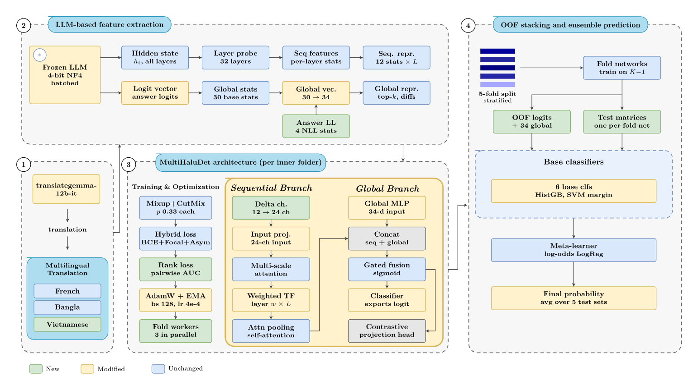

# MultiHaluDet (improved)

White-box hallucination detection for LLMs from their internal states, evaluated on HaluEval QA (English, French, Vietnamese).



## Overview

1. **Translation**: HaluEval is translated into other languages with `translategemma-12b-it` (`data/halueval_{lang}.json`).
2. **Feature extraction** (frozen LLM, 4-bit NF4): per-layer statistics of hidden states from 32 sampled layers (12 statistics x L), plus global features from the output logits (30 base + 4 answer log-likelihood statistics).
3. **MultiHaluDet** (trained per inner fold): a sequential branch (delta channels, multi-scale attention, Transformer, attention pooling) and a global branch (MLP), merged by gated fusion. Loss: BCE + Focal + Asymmetric + Contrastive (+ pairwise AUC rank loss), AdamW + EMA, Mixup/CutMix.
4. **Stacking**: out-of-fold logits of the 5 fold networks + 34 global features feed 6 base classifiers (RF, HistGB, LR, SVM, XGB, LGBM); a logistic-regression meta-learner combines their log-odds. The final probability is averaged over the 5 test sets.

Improvements (all enabled by `--improved`): `--layer_delta`, `--layer_scale`, `--rank_weight 0.1`, `--answer_ll`, `--stack_mode logit`. With no flag, the base pipeline runs.

## Setup

```bash
git clone <repo-url> && cd <repo>
python -m venv .venv && source .venv/bin/activate

pip install torch transformers accelerate bitsandbytes datasets \
            scikit-learn scipy numpy joblib xgboost lightgbm \
            matplotlib tqdm python-dotenv
```

HuggingFace token (required for the gated `meta-llama/Llama-2-7b-hf`):

```bash
echo "HF_TOKEN=hf_xxx" > .env
```

Expected layout (the code imports `src.*`):

```
.
├── run_pipeline.py
├── figures/pipeline.png
├── data/                      # halueval_{en,fr,vi}.json (en falls back to HuggingFace if missing)
├── src/
│   ├── config.py
│   ├── data/        loader.py, feature_extractor.py
│   ├── models/      multihaludet.py, losses.py
│   ├── training/    trainer.py, augmentations.py
│   ├── ensemble/    meta_learner.py
│   └── utils/       metrics.py, visualization.py
└── results/                   # created automatically: features/, oof/, plots/
```

Hardware: a CUDA GPU is expected (the 4-bit LLM takes ~4 GB, so a 6 GB GPU is enough). On CUDA OOM during extraction, use `--extract_batch_size 2`.

## Run

The default seed is **42** (`Config.seed`); omit `--seed` to use it.

```bash
# Base
python run_pipeline.py --model mistral-7b --lang en --tag base

# Improved
python run_pipeline.py --model mistral-7b --lang en --improved --tag improved
```

Main options:

| Flag | Values | Default |
|---|---|---|
| `--model` | `mistral-7b`, `llama2-7b` | `mistral-7b` |
| `--lang` | `en`, `fr`, `bn`, `am`, `vi` | `en` |
| `--dataset` | `halueval`, `triviaqa` | `halueval` |
| `--stage` | `all`, `extract`, `train_oof`, `ensemble` | `all` |
| `--seed` | integer | 42 |
| `--tag` | suffix for OOF/plot files | empty |

Run stage by stage (extracted LLM features are reused across seeds and variants):

```bash
python run_pipeline.py --model mistral-7b --lang vi --stage extract
python run_pipeline.py --model mistral-7b --lang vi --stage train_oof --improved --tag improved
python run_pipeline.py --model mistral-7b --lang vi --stage ensemble  --improved --tag improved
```

`train_oof` and `ensemble` must use the same improvement flags and the same `--tag`.

Multiple seeds:

```bash
for s in 1 11 29 37 43; do
  python run_pipeline.py --model mistral-7b --lang en --stage train_oof --seed $s --tag base_s$s
  python run_pipeline.py --model mistral-7b --lang en --stage ensemble  --seed $s --tag base_s$s
done
```

Outputs: `results/features/` (LLM features), `results/oof/` (out-of-fold outputs), `results/plots/results_*.png` (ROC, PR, calibration, confusion matrix, ...). AUC, F1 and accuracy are printed to the terminal.

## Results (AUROC, HaluEval QA)

Mean ± sample std over 5 seeds: 1, 11, 29, 37, 43.

| Model | Language | Base | Improved | Δ | Improved wins |
|---|---|---|---|---|---|
| Mistral-7B | English | 0.9849 ± 0.0030 | **0.9869 ± 0.0030** | +0.0020 | 5/5 |
| Mistral-7B | French | 0.9746 ± 0.0014 | **0.9774 ± 0.0019** | +0.0028 | 5/5 |
| Mistral-7B | Vietnamese | 0.9683 ± 0.0012 | **0.9730 ± 0.0012** | +0.0047 | 5/5 |
| Llama-2-7B | English | 0.9846 ± 0.0022 | **0.9864 ± 0.0024** | +0.0018 | 4/5 |
| Llama-2-7B | French | 0.9738 ± 0.0012 | **0.9776 ± 0.0027** | +0.0037 | 5/5 |
| Llama-2-7B | Vietnamese | 0.9705 ± 0.0020 | **0.9741 ± 0.0016** | +0.0037 | 5/5 |

Per-seed results (Base / Improved):

| Model | Lang | seed 1 | seed 11 | seed 29 | seed 37 | seed 43 |
|---|---|---|---|---|---|---|
| Mistral-7B | en | .9836 / .9837 | .9837 / .9861 | .9900 / .9912 | .9825 / .9851 | .9846 / .9884 |
| Mistral-7B | fr | .9734 / .9752 | .9729 / .9784 | .9761 / .9780 | .9757 / .9797 | .9747 / .9757 |
| Mistral-7B | vi | .9683 / .9724 | .9680 / .9731 | .9702 / .9750 | .9680 / .9719 | .9669 / .9726 |
| Llama-2-7B | en | .9812 / .9841 | .9848 / .9857 | .9868 / .9902 | .9838 / .9869 | .9862 / .9851 |
| Llama-2-7B | fr | .9729 / .9750 | .9750 / .9790 | .9751 / .9809 | .9736 / .9784 | .9726 / .9746 |
| Llama-2-7B | vi | .9722 / .9727 | .9701 / .9743 | .9729 / .9765 | .9689 / .9745 | .9682 / .9726 |

## Notes

- Speed settings: `batch_size=128`, `lr=4e-4`, `ema_decay=0.995`. The paper's values are 28, 2e-4 and 0.999 (see `src/config.py`).
- The seed changes both the train/test split and the inner folds.
- Bangla (`bn`) and Amharic (`am`) require a local translated file `data/halueval_{lang}.json`.
